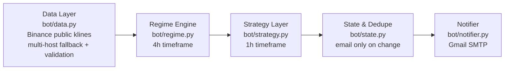

# System Architecture — Regime-Aware Crypto Trade-Signal Bot

This document is the design blueprint behind the bot in `bot/`. It follows a
four-layer architecture: **regime detection → strategy selection → risk
framing → data pipeline resilience**, with a final verification/red-team
section listing known weaknesses honestly.

The system is **signal-only**: it never places orders. It watches BTC
(ETH was dropped after a 1200-day backtest showed its trend edge decays to
profit factor 1.00 over the long window while BTC's holds at 1.21),
decides LONG / SHORT / FLAT, and emails you only when the decision changes.



**Timeframe hierarchy:** the 4h chart decides *what kind of market* we are in
(regime); the 1h chart decides *whether to act now* (signal). Strategies never
self-classify the market — they consume the regime as input. This separation
is the core architectural rule.

---

## Layer 1 — Regime Detection Engine (`bot/regime.py`)

The market state is classified on two deliberately coarse axes:

| Axis | States | Metric |
|------|--------|--------|
| Direction | `TREND_UP` / `TREND_DOWN` / `RANGE` | Price vs EMA50 vs EMA200 alignment on 4h |
| Volatility | `COMPRESSION` / `NORMAL` / `EXPANSION` | 20-bar realized vol vs its own trailing 150-reading percentile (≤30th = compression, ≥70th = expansion) |

- A trend is only declared on **full alignment** (`price > EMA50 > EMA200` or
  the inverse). Anything mixed defaults to `RANGE` — the safer state, because
  `RANGE` strategies require *more* confirmation before acting.
- A **confidence score** (0–1) is published downstream: EMA separation
  normalized by ATR. Wide, clean separation = decisive trend; for `RANGE` the
  score inverts (tightly braided EMAs = confidently ranging).
- Coarseness is intentional **anti-overfitting**: two axes, three states each,
  no fitted parameters beyond standard indicator lengths. A regime model with
  fewer states is harder to fool and degrades more gracefully than an HMM
  fitted to one historical sample.

*Design headroom (not yet implemented):* funding-rate level/momentum, open-
interest deltas, and perp-spot basis are the natural crypto-endogenous inputs
for a future regime upgrade; a CUSUM change-point overlay could give faster
switches than the EMA structure alone.

## Layer 2 — Strategy Matrix (`bot/strategy.py`)

Three behaviors mapped to regimes, chosen because their failure modes do not
overlap:

| Regime | Behavior | Edge |
|--------|----------|------|
| `TREND_UP` / `TREND_DOWN` | Trend-following: 1h EMA20/EMA50 aligned with the 4h trend, RSI filter blocks chasing exhaustion (no longs above RSI 70, no shorts below RSI 30) | Momentum persistence |
| `RANGE` + normal/compressed vol | Mean reversion: RSI extreme **and** Bollinger band touch required together; target is the middle band | Range oscillation |
| `RANGE` + `EXPANSION` | **Stand aside.** Fading extremes during a volatility blow-up is the classic account-killer, so mean reversion is hard-disabled | Capital preservation |

**Hysteresis (anti-flip-flop):** entries are strict (multiple aligned
conditions), exits are loose (a long survives until price closes through the
1h EMA50, not merely until the EMA20/50 cross reverses). Without this
asymmetry a 15-minute cron would whipsaw emails on every borderline bar.

**Synergy:** the strategies are mutually exclusive by construction — exactly
one behavior is live per symbol per regime — so there is no overlapping
directional risk to net out. Equity-curve smoothing comes from regime
switching, not from running correlated books simultaneously.

## Layer 3 — Risk Framing

The bot does not size positions (it never trades), but every actionable
signal ships a complete plan so the human can apply fixed-fractional risk:

- **Stop:** entry ∓ 1.5 × ATR(14) on the 1h — volatility-scaled, so stops
  widen in fast markets and tighten in quiet ones.
- **Target:** 1.5R for trend entries; the Bollinger middle band for
  mean-reversion entries (the mean *is* the thesis).
- **Recommended human rule (README):** risk ≤ 1% of capital per signal; the
  stop distance defines position size, never the other way around.

**Circuit-breakers (system level):**
- Stale-feed detector: if the newest closed candle is older than 2 intervals,
  the symbol is skipped and the previous state is preserved (no decisions on
  bad data — `bot/data.py` raises, `bot/main.py` catches).
- The still-forming candle is always discarded; signals fire on closed bars
  only, eliminating intra-bar repaint.
- Gmail failure exits non-zero so the GitHub Actions run shows red — silent
  notification loss is treated as a failure, not a soft error.

## Layer 4 — Data Pipeline & Edge-Case Handling (`bot/data.py`)

```
Binance public REST ──► host fallback chain ──► validation ──► closed-bar series
(data-api.binance.vision → api.binance.com → api1 → api2, 3 attempts, backoff)
```

Failure modes handled:

| Failure | Defense |
|---------|---------|
| Host unreachable / geo-blocked (e.g., 451 from US CI runners) | 4-host fallback chain, `data-api.binance.vision` first |
| Transient network errors | Retries with exponential backoff (2s, 4s) |
| Stale feed / exchange halt | Staleness check: newest closed bar must be < 2 intervals old |
| Corrupt payload | Type/length checks, positive-price check, strictly increasing timestamps |
| In-progress candle repaint | Last bar dropped unless fully closed |
| One symbol failing | Per-symbol isolation: the other symbol still evaluates; run fails only if *all* symbols fail |
| Duplicate notifications across runs | `state/last_signals.json` committed back to the repo by the workflow — state survives stateless CI runs |
| Synthetic data for testing | `tests/test_strategy.py` generates trending (with realistic pullbacks), mirrored-downtrend, and ranging series — regime and strategy logic are verified offline, no live feed needed |

## Layer 5 — Evidence & Feedback Loop

Added after the initial release; closes the loop between signals and truth.

- **Backtest engine (`bot/backtest.py`):** walk-forward replay of history
  through the *live* `detect_regime()`/`decide()` functions — there is no
  separate backtest strategy that could diverge from production. Conservative
  by construction: entries at signal-bar close, stop wins ties with the
  target inside a bar, 0.16% round-trip fees. The funding filter is not
  simulated (no reliable free history), so live should be slightly
  better-filtered than the backtest.
- **Entry vetoes (`bot/filters.py`):** funding-rate crowding veto
  (|funding| > 0.05%/8h blocks the crowded side; sources: Binance futures →
  Bybit → OKX, skipped gracefully if all fail) and a BTC-trend veto for alt
  entries. Vetoes apply to fresh entries only — never to exits.
- **Trade tracking (`bot/tracker.py`):** open positions carry their plan in
  the state file; stop/target touches are detected on closed 1h bars
  (conservative: stop assumed first if both touch in one bar), alerted, and
  appended to `state/ledger.json` with the realized R. Stop-outs trigger a
  6-hour re-entry cooldown.
- **Weekly scorecard (`bot/report.py`):** Monday cron summarizing the ledger
  — measured win rate and total R, weekly and all-time.

## Layer 6 — The Brain (`bot/brain.py`): AI analyst, never a decider

An optional Claude-powered commentary layer appends a plain-language market
read to each alert. Its authority is deliberately **zero**:

- **Why it cannot decide trades:** an LLM's trade judgment is unvalidatable
  within this system's evidence loop. Backtesting it is contaminated by
  construction — a model trained on historical data has effectively *seen*
  the answers (look-ahead bias) — and live, its hunches would be exactly the
  kind of unmeasured discretion the backtest-validate-promote process exists
  to eliminate.
- **What it adds instead:** interpretation (what the regime/signal means),
  situational risk notes, and discipline reminders — value that doesn't
  require predictive validity.
- **Failure mode:** any API error, refusal, or missing key degrades to a
  normal alert without commentary. The Brain can never delay or block a
  notification.

## Verification Layer — Known Weaknesses (read this honestly)

1. **Regime lag is irreducible.** EMA-alignment regimes confirm trends late
   and release them late. The bot will miss the first leg of new trends and
   give back profit at tops. This is the cost of robustness, accepted by design.
2. **No signal has a "highest success rate."** Trend-following systems of
   this class historically win ~35–45% of trades and profit via asymmetric
   R-multiples, not accuracy. Any tool promising high win rates in crypto is
   lying. The edge here is discipline: regime filtering, volatility-aware
   stops, and refusing to trade expansion-regime chop.
3. **Whipsaw clusters.** In transitional markets the 4h regime can oscillate,
   producing entry→exit→entry sequences. Hysteresis dampens but cannot
   eliminate this; expect it around major macro events.
4. **Single-venue data.** Binance composite-quality data, but still one
   venue. A Binance-specific flash print can color a signal. (Mitigation
   path: cross-validate closes against a second venue before acting.)
5. **15-minute granularity.** Signals evaluate on closed 1h bars checked
   every 15 minutes — this is a swing-trading cadence, not scalping. Stops in
   the email are *suggestions to place at your venue*, not monitored live.
6. **Feedback loops avoided:** the bot holds no positions and uses no
   account data, so its own behavior cannot pollute its inputs — the loop
   that plagues live regime engines is structurally absent at this scale.
